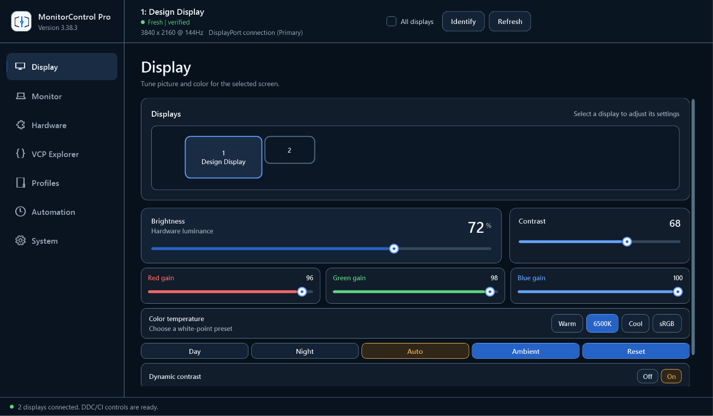

# MonitorControl Pro

<p align="center">
  
  
  
  
  
</p>

A comprehensive Windows GUI utility for controlling monitor settings via DDC/CI protocol. Adjust brightness, contrast, color temperature, input sources, and more — all without touching your monitor's physical buttons.

<p align="center">
  
</p>

## Features

### Display Controls
- **Modern Control Center** — Seven focused workspaces share persistent navigation, selected-display context, compact bento-style cards, accessible contrast, and DPI-aware layouts; System adds category navigation for Display & DDC, Safety, Automation, Diagnostics, and Integrations
- **Brightness & Contrast** — Real-time adjustment via DDC/CI
- **RGB Gain Control** — Fine-tune red, green, and blue channels independently
- **Color Temperature Presets** — Quick access to Warm (5000K), 6500K (D65), Cool (9300K), and sRGB
- **Sharpness Control** — Adjust display sharpness if supported
- **Dynamic Contrast** — Switch display mode between standard (`0x00`) and dynamic contrast (`0xF0`) through VCP `0xDC` on monitors that expose it
- **Picture Mode Presets** — Apply Web/Productivity (`0x01`), Cinema/Movie (`0x03`), or Game (`0x05`) display modes through VCP `0xDC`

### Monitor Management
- **Visual Monitor Layout** — Click-to-select interface matching Windows Display Settings
- **Input Source Switching** — Switch between HDMI, DisplayPort, USB-C, DVI, VGA
- **Power Control** — Turn monitors On, Standby, or Off via software
- **PiP / PbP Controls** — Toggle vendor-defined PiP/PbP modes and secondary input routing for ultrawide monitors that expose those DDC/CI controls
- **Apply to All Monitors** — Sync settings across all connected displays
- **Monitor Identification** — On-screen overlays showing monitor numbers
- **Laptop Brightness Fallback** — Uses `WmiMonitorBrightnessMethods` for integrated displays when DDC/CI handles are unavailable
- **Safe Monitor Refresh** — Re-enumeration and app close destroy stale physical-monitor handles once before replacing the monitor list

### Automation
- **System Tray Mode** - Persistent notification-area icon with a brightness popup, linked-monitor toggle, and profile cycling
- **Per-Application Profiles** - Watch the foreground app and automatically apply a saved profile when its executable matches a rule
- **Scheduled Profiles** - Apply saved profiles automatically from explicit `HH:mm` daily schedule rules with a 24-hour timeline view
- **Idle Dim** - Poll Windows idle time and dim all monitors after inactivity, with optional brightness restore on activity
- **Ambient Light Mode** - Poll Windows `LightSensor` readings and map lux to monitor brightness automatically when a sensor is available
- **Battery Profile** - Apply separate brightness targets when Windows switches between AC power and battery
- **Local Automation Bridge** - Disabled-by-default localhost HTTP bridge for list/read brightness, set brightness, and profile load commands
- **Auto Mode** - Automatic brightness and color temperature based on time of day:
  - Day (7 AM - 6 PM): 80% brightness, neutral colors
  - Evening (6 PM - 9 PM): 60% brightness, slightly warm
  - Night (9 PM - 7 AM): 40% brightness, warm/reduced blue light
- **Profile System** — Save and load custom configurations
- **Hardened Profile Storage** — Profile and automation JSON writes use atomic replacement, valid backups, corrupt-file quarantine, and filename validation
- **Command-line Support** — Launch minimized or with a specific profile

### Advanced Features
- **VCP Explorer** — Query and set any VCP code for advanced users
- **VCP Code Scanner** — Discover which DDC/CI features your monitor supports, including extended MCCS codes for gamma, OSD controls, indicators, auxiliary power, and display modes
- **Capabilities-Aware Controls** — Parses monitor `vcp(...)` capabilities, disables controls that are known unsupported, and can scan either reported capabilities or the full probe table
- **Monitor-Reported Value Ranges** — Brightness, contrast, RGB gain, volume, and sharpness honour each monitor's own reported maximum. Profiles, schedules, idle dim, battery targets, ambient mode, the tray popup, and the automation bridge all speak percentages, which are converted to each display's raw range at the moment of writing, so linking monitors with different ranges produces the same perceived level rather than the same raw number
- **Crash-Safe Capability Discovery** — Requires explicit consent, persists a per-probe crash sentinel, automatically excludes an interrupted monitor identity, and offers a maximum-compatibility mode that never requests capability strings
- **Capability Caching and a Known-Bad Model List** — A successful capability read is cached against the monitor's stable identity and replayed on later launches, so the riskiest native call runs once per monitor rather than on every refresh. Monitor models documented upstream as faulting the Windows kernel during that call are skipped before any probe and reported in diagnostics
- **Stable Monitor Identity** — Prefers the Windows DisplayManager device-interface path and raw EDID, with the existing EDID/device-path lookup as a guarded fallback. Existing labels, profile targets, safety unlocks, capability state, timing, and brightness restore settings migrate automatically, while custom labels and saved profiles continue to follow a display after reordering
- **System-Aware Accessibility** — Follows Windows high contrast live across the main window, the tray popup, and the identify and FPS overlays, supports 100–200% text scaling with independently scrollable content and navigation, exposes visible keyboard focus and UI Automation names, and raises native live-region events for inline errors
- **Portable Release ZIP** — Local release builds package the script, icon, README, LICENSE, signature status, and SHA256 checksums
- **Verified Risky Writes** — Power, input, reset, color preset, OSD lock, OSD language, auxiliary power, PiP/PbP, and arbitrary commands require a per-monitor identity unlock plus an exact code/value confirmation. The confirmation names the specific consequence for that code, and readback reports verified, mismatched, or unavailable outcomes
- **Async Capabilities Reads** — Monitor `vcp(...)` capabilities load from a background worker after enumeration, keeping refresh responsive
- **DDC Compatibility Report** — Builds a copyable diagnostics report with monitor identities, capability status, common VCP probe results, per-monitor liveness history, OS/GPU driver data, and recent DDC errors
- **Panel Metadata** — When Windows DisplayManager is available, the compatibility report includes the physical connector and panel-reported peak luminance alongside registry-free EDID data
- **No-Hardware Regression Tests** — Pester tests cover schedule rollover, idle tick wraparound, profile transactions, hostile bundles, capability safety, risky-write rollback, bridge framing/auth, and VCP input parsing
- **Async VCP Reads** — VCP Explorer query and scan operations run in a background worker with live scan progress
- **Async Monitor Refresh** — Monitor brightness, contrast, color gain, volume, and sharpness reads refresh from a background worker
- **Silent DDC Recovery** — While the DDC pipeline is otherwise idle, one inexpensive supported VCP code is read from each monitor every 60 seconds. The probe never writes to a display. If one channel fails while others answer, stale physical-monitor handles are destroyed and the complete inventory is re-enumerated once for that recovery generation
- **Coalesced Routine Writes** — Sliders, presets, and brightness automation queue on a background worker so rapid routine changes do not block the WPF thread
- **No Redundant DDC Writes** — Reads and writes record each monitor's current value, and a routine write that would not change it is skipped and counted rather than sent. Repeating automation such as ambient mode touches the panel once instead of on every poll, which matters because many monitors store these settings in limited-endurance EEPROM. The cache is dropped whenever monitor handles are released, and verified profile writes always go through
- **Recoverable Profile Apply** — Profile loads snapshot every readable hardware value, verify writes, and restore readable prior values in reverse order after a failure or mismatch
- **DDC/CI Diagnostics** — Failed reads and writes include monitor name, VCP code, attempted value, Win32 error, and retry count in a copyable VCP Explorer summary
- **DDC/CI Capabilities Viewer** — View raw capabilities string from monitor
- **Software Gamma Control** — Independent RGB gamma curves via Windows API
- **Factory Reset** — Reset monitor to factory defaults (colors only or full reset)

### GPU Monitoring (NVIDIA / AMD)
- Real-time temperature, utilization, and clock speed
- Memory usage and fan speed
- Power draw monitoring
- Digital vibrance slider using NVAPI DVC where supported
- AMD Radeon temperature, utilization, engine/memory clocks, and fan percent via ADL where supported by the installed driver
- CPU package/core temperature via LibreHardwareMonitorLib or OpenHardwareMonitorLib, after you enable the helper in System
- PresentMon-powered FPS overlay, after you enable the helper in System

## Requirements

- **Windows 10/11**
- **PowerShell 5.1+** (included with Windows)
- **DDC/CI Compatible Monitor** — Most modern monitors support this; ensure it's enabled in your monitor's OSD settings
- **NVIDIA or AMD GPU** (optional) — For GPU monitoring tab
- **LibreHardwareMonitorLib.dll or OpenHardwareMonitorLib.dll** (optional, 0.9.0+) — For CPU temperature on the hardware tab. Disabled until you enable it under **System > Integrations**
- **PresentMon.exe** (optional, 1.6+) — For FPS overlay capture on the hardware tab. Disabled until you enable it under **System > Integrations**

## Installation

### Option 1: Portable Release ZIP
1. Download `MonitorControlPro-vX.Y.Z.zip` from the GitHub release.
2. Extract the ZIP to a writable folder.
3. Verify `SHA256SUMS`, then run `MonitorControlPro.ps1`.

### Option 2: From PowerShell
```powershell
irm https://raw.githubusercontent.com/SysAdminDoc/MonitorControl/main/MonitorControlPro.ps1 -OutFile MonitorControlPro.ps1
.\MonitorControlPro.ps1
```

### Option 3: Create a Shortcut
```powershell
$WshShell = New-Object -ComObject WScript.Shell
$Shortcut = $WshShell.CreateShortcut("$env:USERPROFILE\Desktop\MonitorControl Pro.lnk")
$Shortcut.TargetPath = "powershell.exe"
$Shortcut.Arguments = "-ExecutionPolicy Bypass -WindowStyle Hidden -File `"$PWD\MonitorControlPro.ps1`""
$Shortcut.IconLocation = "imageres.dll,109"
$Shortcut.Save()
```

### Build a Release ZIP
```powershell
.\tools\build-release.ps1
```

The release builder composes the source modules into one PowerShell 5.1-compatible script, writes an unsigned `dist\MonitorControlPro-vX.Y.Z.zip`, and includes `SIGNING.txt` plus `SHA256SUMS` in the ZIP. The portable ZIP does not require the development `src` directory.

### Run No-Hardware Tests
```powershell
.\tools\run-tests.ps1
```

The deterministic suite requires Pester 5.9.0, composes the same standalone script as the release builder, and imports only selected function definitions from that disposable output. It does not enumerate displays, open the WPF app, or require DDC/CI hardware.

### Run the Full Windows Verification Lane
```powershell
# Run from Windows PowerShell 5.1
Install-Module Pester -RequiredVersion 5.9.0 -Scope CurrentUser
Install-Module PSScriptAnalyzer -RequiredVersion 1.25.0 -Scope CurrentUser
.\tools\verify.ps1
```

This is the same pinned lane used by CI. It gates a pure-ASCII check across every PowerShell source, static-analysis errors and warnings against `PSScriptAnalyzerSettings.psd1`, deterministic protocol/persistence/concurrency tests, isolated standard and high-contrast/200%-text UI Automation smokes, native accessibility-event delivery, and an unsigned portable ZIP build. The WPF smoke tests redirect `APPDATA` and `LOCALAPPDATA` to disposable directories and verify that the real `%APPDATA%\MonitorControlPro` tree is unchanged.

## Usage

### Basic Usage
```powershell
.\MonitorControlPro.ps1
```

### Command-Line Parameters
```powershell
# Start minimized (useful for startup)
.\MonitorControlPro.ps1 -StartMinimized

# Load a specific profile on launch
.\MonitorControlPro.ps1 -LoadProfile "Gaming"

# Combined
.\MonitorControlPro.ps1 -StartMinimized -LoadProfile "Night Mode"

# Force an accessibility theme or text scale for validation
.\MonitorControlPro.ps1 -Theme HighContrast -TextScalePercent 200
```

`-Theme System` (the default) follows live Windows high-contrast changes. `-Theme Dark` and `-Theme HighContrast` are explicit overrides. `-TextScalePercent 0` (the default) follows the Windows text-size setting; values from 100 through 200 override it.

### Tray Mode
- Minimize the window to keep MonitorControl running from the notification area
- Click the tray icon to open the compact brightness popup
- Enable **System > Automation > Run at login** to create a per-user Startup-folder shortcut that launches directly into tray mode; disabling it removes the shortcut
- Double-click the tray icon or use **Next Profile** in the tray menu to cycle saved profiles
- Use **Link Monitors** in the tray popup or menu to apply brightness changes to every detected monitor

### Per-Application Profiles
- Create or load a saved monitor profile
- Open the **Profiles** tab, enable **Per-application profiles**, and map an executable name such as `photoshop.exe` to a profile
- Use **Capture** to grab the foreground executable after a short delay, or type the executable name directly
- Leave **Risky writes** off unless that exact application rule should be allowed to use risky profile values; enabling it shows a separate rule-level warning and does not bypass the per-monitor unlock
- Rules are saved in `%APPDATA%\MonitorControlPro\app-profile-rules.json`

### Scheduled Profiles
- Create or load a saved monitor profile
- Open the **Automation** tab, enable **Scheduled profiles**, and add `HH:mm` rules that map times to profiles
- Leave **Risky writes** off unless that exact schedule rule should be allowed to use risky profile values; the target monitor identity must still be unlocked separately
- The timeline plots rules against a 24-hour axis so timing gaps are visible before saving more rules
- The watcher applies the latest due rule once per schedule boundary, including the current effective rule when scheduling is enabled
- Rules are saved in `%APPDATA%\MonitorControlPro\profile-schedules.json`

### Idle Dim
- Open the **Automation** tab and enable **Idle dim**
- Set the idle threshold in minutes, target brightness, and whether activity should restore the previous brightness
- Settings are saved in `%APPDATA%\MonitorControlPro\idle-dim.json`

### Local Automation Bridge
- Open **System > Automation** and enable **Local Automation Bridge** only when needed
- Default bind is `127.0.0.1:34291`; enabling a non-loopback address requires an explicit network-exposure warning because the bridge uses unencrypted HTTP
- Only an exact, body-free `GET /api/health` is unauthenticated; every other request requires the generated key through `X-MonitorControl-Key` or `Authorization: Bearer <key>`
- Query-string and JSON-body API keys are rejected, and the saved key is encrypted for the current Windows user with DPAPI
- A separate per-install random entropy file hardens the saved DPAPI blob against generic credential harvesting. The key remains a local-trust token, not a secret against software already running as your Windows user
- The listener enforces request-line, header-count, header-size, body-size, response-size, concurrency, and socket-deadline limits; malformed framing receives a deterministic 4xx response
- Supported endpoints are `GET /api/health`, `GET /api/monitors`, `GET /api/profiles`, `GET /api/brightness`, `POST /api/brightness`, and `POST /api/profile`
- Brightness is expressed as a percentage in both directions. `GET /api/brightness` also returns the `raw` DDC value and the monitor's reported `maximum`, and `GET /api/monitors` reports `BrightnessMaximum` per display
- The bridge is HTTP only. There is no MQTT or Home Assistant transport; a settings file from an older version that still carries the unused `MqttEnabled` field loads normally and the field is dropped on the next save

### Restoring Brightness After Sleep

Many monitors forget their brightness across a power or sleep cycle and come back at full
output. Open **System > Display & DDC** and enable **Restore brightness at launch and after resume**.

- The last brightness you set for each display is remembered against its stable monitor identity.
- It is written back once per detected display change, so a burst of hot-plug events cannot
  replay writes, and it goes through the verified write path with rollback.
- Displays with no stable identity, no DDC/CI handle, or no reported brightness control are
  skipped rather than guessed at.
- The setting is off by default, because restoring writes to hardware without being asked.

### Optional Hardware Helpers

MonitorControl Pro can read CPU temperature through LibreHardwareMonitorLib/OpenHardwareMonitorLib
and drive the FPS overlay through PresentMon. Both are third-party binaries that the app would
otherwise load or execute from the folder it was extracted into, so both are **off by default**.

- Open **System > Integrations** and enable only what you installed yourself. Each
  toggle shows a warning before anything is loaded or run.
- Nothing is loaded or executed before you enable it, and no settings file is written until you act.
- Once enabled, the panel reports the resolved absolute path, where it came from (script directory,
  Program Files, PATH, or elsewhere), the file and product version, and the SHA-256 of the binary.
- Helpers below the supported minimum, or with no readable version resource, are refused with the
  reason shown rather than loaded.
- PresentMon is looked up in the script directory and Program Files **before** PATH, is run with a
  timeout, and has its output size-capped; a run that overruns is stopped.
- Turning a helper off closes the integration, stops the overlay, and leaves monitor control
  untouched. A .NET assembly cannot be unloaded from a running process, so the CPU library stops
  being used immediately but is fully gone only after a restart.

### Capability Discovery Safety
- On first launch, choose whether MonitorControl Pro may request full DDC/CI capability strings from monitor firmware
- Choose **No** or enable **Maximum compatibility** in **System > Display & DDC** to prevent all capability-string requests
- Before each enabled request, the app persists the selected monitor identity in a crash sentinel and clears it only after the native call returns
- If the app or Windows exits during a request, discovery is disabled on the next launch and that monitor identity is excluded
- Use **Exclude selected** or **Clear exclusions** in **System > Display & DDC** to manage the per-monitor exclusion list
- A successful read is cached in `%APPDATA%\MonitorControlPro\capabilities-cache.json` and replayed on later launches; use **Clear cache** to force a re-read
- Monitor models known upstream to fault the Windows kernel during a capability read are skipped before any probe, with the reason shown in the DDC compatibility report

### DDC Timing Per Monitor

Panels differ by an order of magnitude in how long they need between DDC/CI requests, so retry
budgets and delays are stored against each stable monitor identity in
`%APPDATA%\MonitorControlPro\ddc-timing.json` and survive restarts.

These controls are under **System > Display & DDC**.

- **Adaptive** (default) learns a sleep multiplier from the first successful handshake with the
  monitor: a panel that answered on attempt three gets three times the default delay between
  retries. The multiplier is clamped to 4x so one bad handshake cannot stall the app
- **Manual** ignores the learned multiplier entirely and uses the default delay, so an operator
  value is never silently modified by calibration. The two modes are mutually exclusive, and
  returning to Adaptive discards the stored calibration and relearns it - the card says so before
  you switch
- Read, write, and capability retry budgets are set separately, each 0-10
- Readback verification is stored per monitor as **Strict**, **Lenient**, or **Off**. Strict treats
  one in-range mismatch as a failure; Lenient waits for one longer calibrated delay and re-reads
  before it can fail or roll back; Off trusts a successful write. The initial verification delay
  and the longer Lenient delay both derive from that monitor's effective timing rather than a
  fixed wait
- A readback above the maximum reported by the monitor is classified as unreliable firmware data.
  The write remains applied and is not rolled back solely because of that impossible value
- A VCP code that fails every retry on a monitor that is answering other codes is recorded as
  null-signalled-unsupported for that monitor and skipped from then on. Some monitors use the DDC
  Null Message to mean "not supported" rather than "not ready", and burning the full retry budget
  on every such code is the usual cause of a scan that looks like a hang. The code is forgotten
  again the moment it answers
- After the first healthy read, the app queries impossible VCP code `0x00` once for that identity.
  An explicit unsupported reply leaves Null responses retryable; a persistent invalid-data/Null
  reply records `NullMeansUnsupported`, so later Null replies stop after one attempt and the code
  is learned immediately. Inconclusive probes are not saved, and mixed panels continue through
  the per-code learning above
- **Reset calibration** clears both the learned multiplier and the skipped-code list for the
  selected monitor
- Effective values, verification policy and delays, calibration state, Null-message classification
  and date, and skipped codes appear in the DDC Compatibility Report
- A separate liveness probe performs one read-only VCP query per monitor every 60 seconds while
  the DDC pipeline is idle. It never writes to a display. The report records the last attempt and
  last successful probe for each display; an isolated failure causes full handle re-acquisition
  instead of continuing to retry a dead handle

### Risky VCP Write Safety
- Risky controls start disabled. Select a display, open **System > Safety**, and explicitly enable risky VCP writes for that stable monitor identity
- The unlock covers power (`0xD6`), input (`0x60`), factory and color reset (`0x04`, `0x08`), color preset (`0x14`), OSD/button control (`0xCA`), OSD language (`0xCC`), auxiliary power (`0xD7`), PiP/PbP (`0xE8`, `0xE9`), and arbitrary VCP writes; identities without a stable key cannot be unlocked
- Color preset is gated because some monitors keep the value after this app closes and need a factory reset to undo it, and OSD/button control is gated because it can disable the monitor's own buttons, which is the only way to recover a display that stops responding to software
- Every direct command shows the exact VCP code, value, and target before writing. Canceling makes no hardware change
- The app reads each supported value back according to the selected monitor's verification policy
  and distinguishes **verified**, **verified after re-read**, **mismatched**, **unreliable
  readback**, **verification off**, and **readback unavailable** outcomes
- Profile loads, direct VCP commands, and brightness restore execute as one verified background
  transaction, so multi-display operations do not block the window. The footer shows operation and
  rollback progress and offers **Cancel**; cancellation is cooperative, restores every readable
  value already applied in reverse order, and reports when a restore could only be partial
- A direct command that fails or reads back mismatched restores the readable prior value, and the status line reports whether that restore was complete or partial
- Profile loads snapshot every readable prior DDC/WMI value and restore those values in reverse order when a write fails or reads back incorrectly
- Automatic compatibility reports omit risky VCP codes; VCP Explorer reads remain explicitly user initiated

### Navigation
- Click on monitor rectangles to select different displays
- Use Tab and Shift+Tab to navigate every interactive control; focus has a visible system-aware outline
- Use Alt+D/M/H/V/P/A/S to open Display, Monitor, Hardware, VCP Explorer, Profiles, Automation, or System
- Within System, use the named Overview, Display & DDC, Safety, Automation, Diagnostics, and Integrations category tabs
- Use Ctrl+R to refresh displays and Escape to dismiss an inline alert
- Slider values update in real-time

## VCP Code Reference

The VCP Explorer tab allows you to query and set any DDC/CI VCP code. Common codes:

| Code | Name | Range | Description |
|------|------|-------|-------------|
| `0x10` | Brightness | 0-100 | Display brightness level |
| `0x12` | Contrast | 0-100 | Display contrast level |
| `0x14` | Color Preset | varies | Color temperature preset (risky: may persist after exit) |
| `0x16` | Red Gain | 0-100 | Red channel gain |
| `0x18` | Green Gain | 0-100 | Green channel gain |
| `0x1A` | Blue Gain | 0-100 | Blue channel gain |
| `0x60` | Input Source | varies | Active input selection |
| `0x62` | Volume | 0-100 | Speaker volume (if available) |
| `0x72` | Gamma | varies | Hardware gamma control when exposed by the monitor |
| `0x87` | Sharpness | 0-100 | Image sharpness |
| `0x8D` | Audio Mute | 1/2 | Mute speakers |
| `0xC0` | Display Usage Time | read-only | Panel usage counter |
| `0xC6` | Application Enable Key | varies | Vendor/application enable key |
| `0xCA` | OSD/Button Control | varies | Monitor OSD and button behavior (risky: can lock physical buttons) |
| `0xCC` | OSD Language | varies | Monitor on-screen display language |
| `0xCD` | Status Indicators / LED | varies | Status indicator and power LED behavior when supported |
| `0xD6` | Power Mode | 1-5 | Power state control |
| `0xD7` | Aux Power Output | varies | Auxiliary power output control when supported |
| `0xDC` | Display Mode | varies | Preset picture/display modes |
| `0xDF` | VCP Version | read-only | Monitor VCP/MCCS version |
| `0xE8` | Secondary Input Source | vendor-defined | Secondary PiP/PbP input on some Dell-style ultrawides |
| `0xE9` | PiP/PbP Mode | vendor-defined | PiP/PbP mode on some Dell-style ultrawides |
| `0x04` | Factory Reset | 1 | Reset all settings |
| `0x08` | Color Reset | 1 | Reset color settings only |

### Input Source Values
| Value | Input |
|-------|-------|
| `0x01` | VGA |
| `0x03` | DVI |
| `0x0F` | DisplayPort 1 |
| `0x10` | DisplayPort 2 |
| `0x11` | HDMI 1 |
| `0x12` | HDMI 2 |
| `0x13` | USB-C |

### PiP / PbP Vendor Values
| Code | Value | Meaning |
|------|-------|---------|
| `0xE9` | `0x00` | PiP/PbP off |
| `0xE9` | `0x21` | PiP upper-right |
| `0xE9` | `0x23` | PbP split |
| `0xE8` | `0x21` | Secondary DisplayPort |
| `0xE8` | `0x11` | Secondary HDMI 1 |
| `0xE8` | `0x12` | Secondary HDMI 2 |

### Power Mode Values
| Value | State |
|-------|-------|
| `0x01` | On |
| `0x02` | Standby |
| `0x04` | Off |

### Display Mode Values
| Value | Mode |
|-------|------|
| `0x00` | Standard / default |
| `0x01` | Productivity / Web |
| `0x03` | Movie / Cinema |
| `0x05` | Games |
| `0xF0` | Dynamic Contrast |

## Profiles

Profiles are saved as JSON files in `%APPDATA%\MonitorControlPro\`

### Profile Contents
```json
{
  "SchemaVersion": 4,
  "Name": "Gaming",
  "MonitorIdentityKey": "edid:0123456789abcdef",
  "MonitorLabel": "Desk Left",
  "MonitorName": "Generic PnP Monitor",
  "MonitorDevicePath": "MONITOR\\ABC1234\\...",
  "MonitorSettings": [
    {
      "IdentityKey": "edid:0123456789abcdef",
      "MonitorLabel": "Desk Left",
      "Brightness": 80,
      "Contrast": 70,
      "Red": 50,
      "Green": 50,
      "Blue": 50,
      "Gamma": 100,
      "GammaRed": 100,
      "GammaGreen": 100,
      "GammaBlue": 100
    }
  ],
  "Brightness": 80,
  "Contrast": 70,
  "Red": 50,
  "Green": 50,
  "Blue": 50,
  "Gamma": 100,
  "GammaRed": 100,
  "GammaGreen": 100,
  "GammaBlue": 100,
  "UpdatedAt": "2026-06-28T10:30:00.0000000-04:00"
}
```

Profiles without `SchemaVersion` are treated as v1 and migrated to the current schema on load.

Schema v4 stores every scaled DDC value (brightness, contrast, RGB gain, volume, sharpness) as a
percentage rather than a raw VCP number. Monitors do not all use a 0-100 range — a panel may
report a maximum of 31 or 255 — so the raw value is derived per monitor when the profile is
applied. Values from profiles written before v4 are clamped into 0-100 on load. Gamma remains a
software curve and is not a DDC value.

Use **Export Bundle** on the Profiles tab to create a manifest-declared, SHA-256 checksummed ZIP in `%APPDATA%\MonitorControlPro\exports`.
Use **Import Bundle** to preview creates, replacements, and skipped conflicts before writing. Imports reject unsafe paths, undeclared or duplicate entries, unsupported schemas, invalid values, oversized content, and suspicious compression ratios.
Accepted profiles are staged on the profile volume and committed as one transaction; a write failure restores every prior profile byte-for-byte and removes newly created destinations.
Use **Sync Folder** to point profile storage at a OneDrive or Dropbox folder. The pointer is stored in `%APPDATA%\MonitorControlPro\profile-storage.json`; **Use Local** switches back to `%APPDATA%\MonitorControlPro`.

### Example Profiles

**Night Mode** — Reduced brightness and blue light
```json
{
  "Name": "Night Mode",
  "Brightness": 35,
  "Contrast": 50,
  "Red": 50,
  "Green": 48,
  "Blue": 40,
  "Gamma": 100,
  "GammaRed": 100,
  "GammaGreen": 95,
  "GammaBlue": 80
}
```

**Photography** — Accurate colors for editing
```json
{
  "Name": "Photography",
  "Brightness": 50,
  "Contrast": 50,
  "Red": 50,
  "Green": 50,
  "Blue": 50,
  "Gamma": 100,
  "GammaRed": 100,
  "GammaGreen": 100,
  "GammaBlue": 100
}
```

## Troubleshooting

### Monitor Not Detected
1. **Enable DDC/CI** — Check your monitor's OSD settings for DDC/CI option and ensure it's enabled
2. **Check Cable** — DDC/CI works best over DisplayPort and HDMI; some adapters don't pass through DDC/CI signals
3. **Try Different Port** — Some monitor ports may have DDC/CI disabled

### Settings Not Applying
- Some monitors have a delay (~50ms per command)
- Certain VCP codes may not be supported by your specific monitor
- Use the VCP Scanner to discover which features your monitor actually supports
- Open **System > Diagnostics** and build the **DDC Compatibility Report** before troubleshooting docks, adapters, GPU drivers, KVMs, or firmware quirks
- Failed DDC/CI reads and writes are retried automatically and surfaced in the status bar; open **VCP Explorer** to copy the latest diagnostic summary with monitor name, VCP code, attempted value, Win32 error, and retry count

### Laptop Display Not Working
Laptop integrated displays typically don't support DDC/CI. Use Windows brightness controls or WMI-based tools instead.

### "No DDC/CI Monitor" Message

The app no longer stops at that message. Every enumeration cross-checks how many displays Windows
reports against how many of them answered a DDC/CI request, and names the difference:

| Reported cause | What it means | What to try |
| --- | --- | --- |
| GPU driver known to break DDC/CI | Your installed driver matches a release with a confirmed DDC/CI regression. The banner names the release that fixed it. | Update to the named release or newer, or roll back to the driver you used before |
| DisplayLink | DisplayLink terminates the DDC/CI channel inside its own driver, so no application can reach the panel | Connect the monitor to a GPU output, or use the DisplayLink monitor for output only |
| Indirect display | A software-synthesized display (`IddCx`, spacedesk, virtual/duplicate adapters) with no physical panel behind it | Nothing to fix - there is no panel to address |
| Remote session | The display belongs to an RDP session, not to hardware on this machine | Run the app on the machine the monitor is attached to |
| Basic display adapter | The Microsoft Basic Display Adapter is active, so the vendor driver that carries DDC/CI is not installed | Install the GPU vendor driver and reboot |
| Internal panel | The laptop panel answers WMI brightness but no other VCP feature | Use an external monitor for contrast, input switching, and colour |
| Unidentified path | The display answers nothing and its path is not one of the above - typically an MST hub, an adapter, a KVM, or a cable missing the DDC pins, or DDC/CI switched off in the OSD | Switch DDC/CI on in the OSD, then connect straight to a GPU output with a certified cable and no hub, dock, or KVM |

The full breakdown - every display path, its classification, and whether it answered - is in the
**DDC Compatibility Report** under **System > Diagnostics**.

## Technical Details

### Source Architecture

- `MonitorControlPro.ps1` is the development launcher and preserves the public command-line switches.
- `src\MonitorControl.Core.psm1`, `Storage`, `Ddc`, `Automation`, and `Bridge` contain testable function definitions without WPF globals.
- `src\MonitorControl.App.ps1` owns native type initialization, XAML, UI binding, handlers, and startup.
- `tools\compile.ps1` composes those sources into the single portable script used by tests and release builds, and rejects duplicate function definitions or invalid PowerShell syntax.

### APIs Used
- **dxva2.dll** — Windows DDC/CI implementation
  - `GetPhysicalMonitorsFromHMONITOR`
  - `GetVCPFeatureAndVCPFeatureReply`
  - `SetVCPFeature`
  - `CapabilitiesRequestAndCapabilitiesReply`
- **gdi32.dll** — Software gamma control
  - `SetDeviceGammaRamp`
- **user32.dll** — Monitor enumeration
  - `EnumDisplayMonitors`
  - `GetMonitorInfo`

### Data Storage
- Profiles: `%APPDATA%\MonitorControlPro\*.json`
- Optional helper consent: `%APPDATA%\MonitorControlPro\optional-helpers.json` (both helpers off by default)
- Remembered brightness for restore: `%APPDATA%\MonitorControlPro\display-restore.json` (off by default)
- Automation bridge settings: `%APPDATA%\MonitorControlPro\automation-bridge.json` (API key protected with current-user DPAPI) and `%APPDATA%\MonitorControlPro\automation-bridge.entropy` (separate per-install entropy)
- Automation bridge write log: `%APPDATA%\MonitorControlPro\automation-bridge-writes.jsonl` (redacted and size-rotated)
- Risky VCP identity unlocks: `%APPDATA%\MonitorControlPro\vcp-write-safety.json`
- No registry modifications
- No admin rights required

## Inspiration & Credits

This project was inspired by and incorporates concepts from these excellent open-source projects:

- **[Twinkle Tray](https://github.com/xanderfrangos/twinkle-tray)** — System tray brightness control, time-based automation
- **[Monitorian](https://github.com/emoacht/Monitorian)** — Clean WPF implementation, unison mode concept
- **[ControlMyMonitor](https://www.nirsoft.net/utils/control_my_monitor.html)** — Comprehensive VCP exploration
- **[MonitorConfig](https://github.com/MartinGC94/MonitorConfig)** — PowerShell DDC/CI module
- **[LightBulb](https://github.com/Tyrrrz/LightBulb)** — Gamma-based color temperature
- **[display-switch](https://github.com/haimgel/display-switch)** — Input source switching concepts

## Contributing

Contributions are welcome! Please feel free to submit a Pull Request.

### Development Setup
1. Clone the repository
2. Edit the matching file under `src` in your preferred editor (VS Code with PowerShell extension recommended)
3. Run `MonitorControlPro.ps1` to exercise the modular development source, or run `tools\compile.ps1` to inspect the composed standalone script under `build`
4. Run `tools\run-tests.ps1` before submitting changes

### Areas for Improvement
- [ ] Multi-monitor profile linking
- [ ] WMI fallback for laptop displays

## License

MIT License — see [LICENSE](LICENSE) for details.

## Disclaimer

This software interacts with monitor hardware via DDC/CI protocol. While DDC/CI is a standard protocol and this software uses official Windows APIs, use at your own risk. The author is not responsible for any damage to monitors or other hardware.

---

<p align="center">
  Made with PowerShell and WPF<br>
  <a href="https://github.com/SysAdminDoc/MonitorControl/issues">Report Bug</a> ·
  <a href="https://github.com/SysAdminDoc/MonitorControl/issues">Request Feature</a>
</p>
