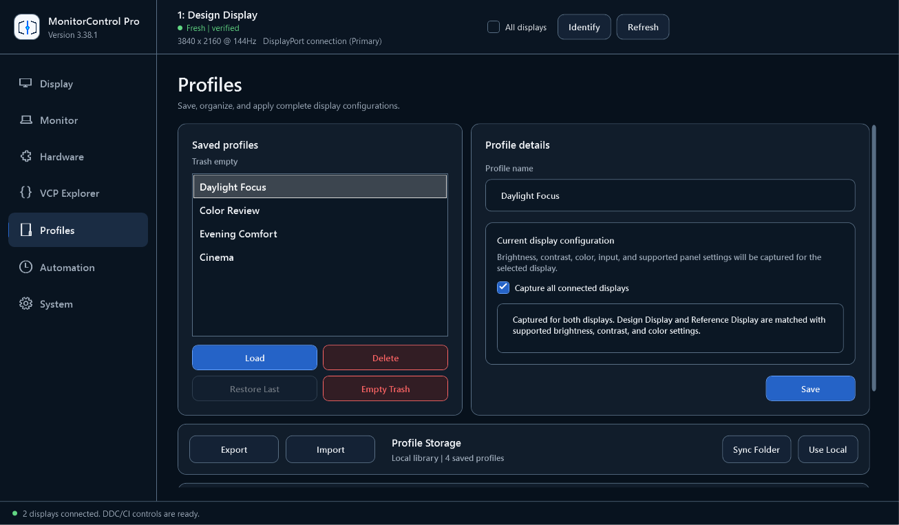
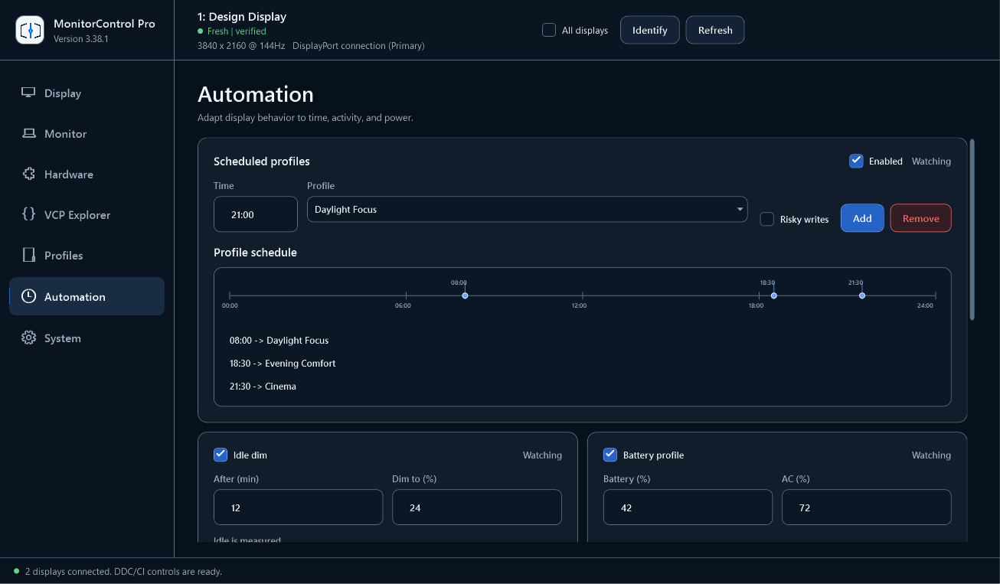
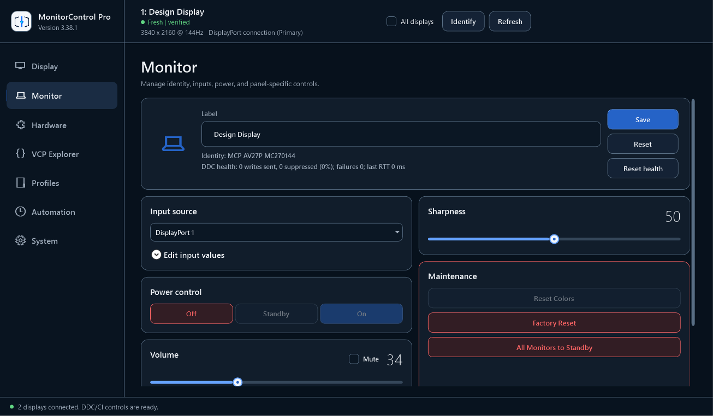
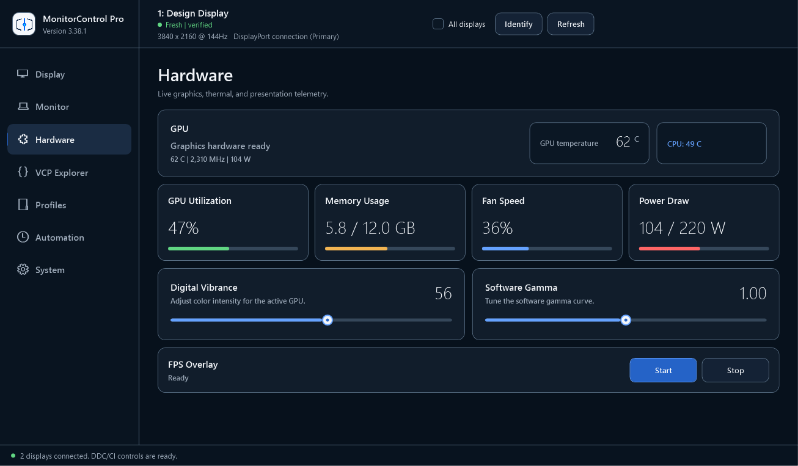

[](https://github.com/SysAdminDoc/MonitorControl/releases/latest)
[](#compatibility)
[](#install)
[](LICENSE)

MonitorControl Pro puts brightness, color, inputs, profiles, and display automation in one focused Windows app. It talks to compatible monitors through DDC/CI, so you can stop reaching for tiny buttons under the bezel.

[Download the latest portable release](https://github.com/SysAdminDoc/MonitorControl/releases/latest)


The screenshots in this repository come from the real WPF app on a private Windows desktop. The capture mode supplies a fixed two-display dataset, then the application renders each page itself.

## Why MonitorControl

- One control center handles mixed resolutions, refresh rates, inputs, and monitor capabilities.
- Profiles follow stable display identities instead of whichever screen Windows happens to call display 1.
- Scheduled profiles, app rules, idle dimming, and battery targets cover the changes you repeat every day.
- Risky VCP commands stay locked until you enable them for a specific monitor.

There is no background service, installer, driver, account, or administrator requirement. Extract the ZIP and run it.

## Product tour

| Profiles | Automation |
|:--:|:--:|
|  |  |
| Save a complete setup for one display or the whole desk. | Change profiles by time, inactivity, application, or power state. |

| Monitor controls | Hardware view |
|:--:|:--:|
|  |  |
| Rename displays, switch inputs, adjust audio, and inspect DDC health. | Keep optional graphics and presentation telemetry close to the display controls. |

## What it controls

| Area | What you can do |
|---|---|
| Picture | Adjust brightness, contrast, RGB gain, color temperature, sharpness, gamma, and supported picture modes. |
| Inputs | Switch among HDMI, DisplayPort, USB-C, DVI, or VGA values reported by the monitor. Custom vendor values are supported. |
| Multiple displays | Select a screen visually, link brightness changes, or capture a separate setting set for every monitor in a profile. |
| Profiles | Save, preview, apply, export, import, restore, and schedule display configurations. |
| Power | Send on, standby, or off commands after the selected monitor has been explicitly unlocked. |
| Diagnostics | Inspect capabilities, query VCP codes, track health, and create a privacy-redacted support bundle. |

Monitor support varies. Controls that the selected display does not advertise are disabled instead of guessed.

## Compatibility

MonitorControl Pro supports:

- Windows 11
- Windows 10 22H2 with Extended Security Updates
- Windows 10 Enterprise LTSC 2021 while it remains serviced
- Windows PowerShell 5.1 in desktop mode

External monitors need DDC/CI enabled in their on-screen menu. A direct GPU connection gives the best results. Some docks, KVMs, adapters, USB display drivers, and cables do not carry the DDC channel.

Integrated laptop panels usually use Windows brightness control rather than DDC/CI. MonitorControl falls back to WMI for laptop brightness, but monitor-only controls such as input switching won't apply to that panel.

GPU telemetry is optional. NVIDIA and AMD paths are detected when their local APIs are available. CPU temperature and the FPS overlay remain off until you opt in to supported local helper binaries.

## Install

### Portable ZIP

1. Open the [latest release](https://github.com/SysAdminDoc/MonitorControl/releases/latest).
2. Download `MonitorControlPro-vX.Y.Z.zip` and its `.sha256` sidecar.
3. Check the download:

   ```powershell
   (Get-FileHash .\MonitorControlPro-vX.Y.Z.zip -Algorithm SHA256).Hash -eq `
     ((Get-Content .\MonitorControlPro-vX.Y.Z.zip.sha256).Split(' ')[0])
   ```

4. Extract the ZIP to a writable folder.
5. Start `MonitorControlPro.cmd`.

The ZIP also contains the standalone PowerShell script, icon files, a CycloneDX SBOM, an artifact manifest, and checksums for the extracted payload.

The current release is unsigned. Windows may show its normal reputation warning the first time you open it. The checksum and manifest let you verify exactly what you downloaded.

### Scoop

The repository includes a versioned Scoop manifest:

```powershell
scoop install https://raw.githubusercontent.com/SysAdminDoc/MonitorControl/main/packaging/scoop/monitorcontrol-pro.json
```

Scoop validates the release hash before extraction. Updates read the published checksum sidecar.

## First run

1. Turn on DDC/CI in the monitor's own menu.
2. Start MonitorControl Pro and select a display.
3. Choose whether the app may request the monitor's full capability string.
4. Move brightness or contrast and confirm the display responds.
5. Give each screen a useful label before creating profiles.

If capability discovery makes a particular monitor unstable, choose maximum compatibility mode. It never requests capability strings. The app also records a crash sentinel before each enabled capability request and can exclude one monitor from future probes.

## Profiles that survive display changes

A profile can capture the selected monitor or every connected display. Each record includes its stable identity and supported picture values. Before apply, MonitorControl shows which connected displays match and which values will be skipped.

Profile writes run as a transaction. Readable values are captured first, changes are verified, and a partial failure triggers rollback in reverse order. Deleted profiles and their dependent rules move to a bounded local trash folder, so Restore Last still works after a restart.

## Automation without hotkeys

MonitorControl does not register keyboard shortcuts. Automation is explicit and visible in the app:

- Apply a profile when a named application becomes active.
- Move through a daily schedule on a 24-hour timeline.
- Dim unused displays after inactivity and restore each screen to its prior level.
- Use separate brightness targets on battery and AC power.
- Switch monitor inputs when a chosen USB device arrives or leaves.
- Expose a disabled-by-default local HTTP bridge for scripts on the same machine.

Input, power, reset, PiP/PbP, OSD, and arbitrary VCP writes require both a monitor unlock and rule-level consent. An automation rule cannot silently grant itself permission.

## Safety model

DDC/CI firmware quality differs by manufacturer and model. MonitorControl takes a conservative approach:

- Capability discovery is opt in and cached after a successful read.
- Models with known capability-query faults are blocked before the native request.
- Routine slider changes run away from the UI thread and duplicate writes are suppressed.
- Risky commands show the exact code, value, monitor, and consequence before they run.
- Verified writes take a readable snapshot and report matched, mismatched, or unavailable readback.
- Per-monitor timing adapts to slower panels without slowing every screen.
- Support bundles hide monitor identifiers, local paths, addresses, and credential-like values by default.

Read [Safety and DDC behavior](docs/SAFETY.md) before enabling power, reset, input, or arbitrary VCP writes.

## Command line

The release script also supports bounded one-shot commands without opening WPF. Start with `list`, then use the stable identity it prints when more than one controllable display is connected.

```powershell
# Inventory
powershell.exe -NoProfile -File .\MonitorControlPro.ps1 list
powershell.exe -NoProfile -File .\MonitorControlPro.ps1 list -Json

# Read brightness
powershell.exe -NoProfile -File .\MonitorControlPro.ps1 get 0x10 `
  -Monitor "winrt:0123456789abcdef"

# Set brightness only when it differs
powershell.exe -NoProfile -File .\MonitorControlPro.ps1 set -Vcp 0x10 -Value 55 `
  -Monitor "winrt:0123456789abcdef" -IfNeeded

# Apply a saved profile
powershell.exe -NoProfile -File .\MonitorControlPro.ps1 profile "Work" -Json
```

JSON output uses a versioned envelope. Risky CLI writes require `-AllowRisky` plus the saved per-monitor unlock from **System > Safety**. See the [command-line reference](docs/CLI.md) for aliases, exit codes, relative changes, cycling, and bridge routes.

## Data and privacy

Settings live under `%APPDATA%\MonitorControlPro`. The app does not need a cloud account and does not send analytics.

Update checks are off by default. When enabled, the app asks the GitHub Releases API whether a newer tag exists. It never downloads or runs an update for you.

The automation bridge binds to `127.0.0.1:34291` by default, uses a generated key, and remains disabled until you turn it on. Exposing it beyond loopback requires a separate warning.

## Troubleshooting

### A display is missing

Enable DDC/CI in the monitor menu, connect directly to the GPU, and try another certified cable. Then press **Refresh**. DisplayLink paths and remote displays have no physical DDC channel.

### Brightness works but other controls do not

That is normal for an integrated laptop panel. Windows can expose laptop brightness through WMI without exposing monitor VCP controls.

### Settings do not stick after power off

Some panels accept a change but do not save it. Open **System > Display & DDC** and enable **Save settings to the monitor after a write** for that display. The save command is rate limited.

### A monitor becomes unavailable after sleep

Enable **Restore brightness at launch and after resume** if the panel forgets brightness. MonitorControl also performs a small read-only liveness check and reacquires stale handles when one display drops while the others still respond.

For a support request, build the redacted DDC report under **System > Diagnostics**. Review it before posting.

## Build and verify

Use Windows PowerShell 5.1 for the application and release tools.

```powershell
# Deterministic no-hardware tests
.\tools\run-tests.ps1

# Full local verification on a private desktop, including WPF and accessibility checks
dotnet run --project .\tools\MonitorControl.MarketingCapture\MonitorControl.MarketingCapture.csproj -c Release -- `
  --operation verify --script .\tools\verify.ps1 --output-dir .\assets\screenshots

# Rebuild the standalone ZIP and integrity sidecars
.\tools\build-release.ps1

# Rebuild the logo, icon, banner, and social preview
pwsh -File .\tools\build-brand-assets.ps1

# Capture all seven product pages on a private Windows desktop
dotnet run --project .\tools\MonitorControl.MarketingCapture\MonitorControl.MarketingCapture.csproj -c Release -- `
  --operation capture --script .\MonitorControlPro.ps1 --output-dir .\assets\screenshots
```

The deterministic test lane requires Pester 5.9.0. Full verification also runs PSScriptAnalyzer and pinned Axe.Windows scans against standard and high-contrast WPF states. Axe runs without desktop screenshots and writes a structured JSON report for each state. Builds happen locally.

Key paths:

| Path | Purpose |
|---|---|
| `MonitorControlPro.ps1` | Development launcher and command-line entry point |
| `src/` | WPF application, storage, DDC, bridge, automation, and core modules |
| `tools/compile.ps1` | Composes the release into one portable script |
| `tools/build-release.ps1` | Produces the ZIP, manifest, checksums, and SBOM |
| `tests/` | No-hardware coverage, transcript replay, WPF smoke, and accessibility checks |
| `assets/brand/` | Approved mark and generated brand surfaces |
| `assets/screenshots/` | Verified product captures and capture report |

## License

MonitorControl Pro is available under the [MIT License](LICENSE).

DDC/CI commands change physical monitor state. Test unfamiliar VCP codes carefully and keep the monitor's hardware controls available while experimenting.
